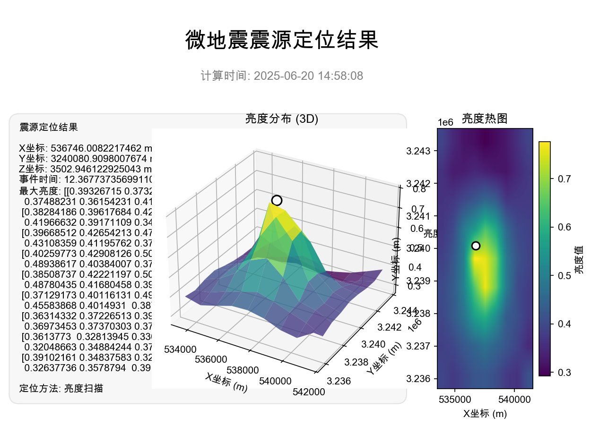
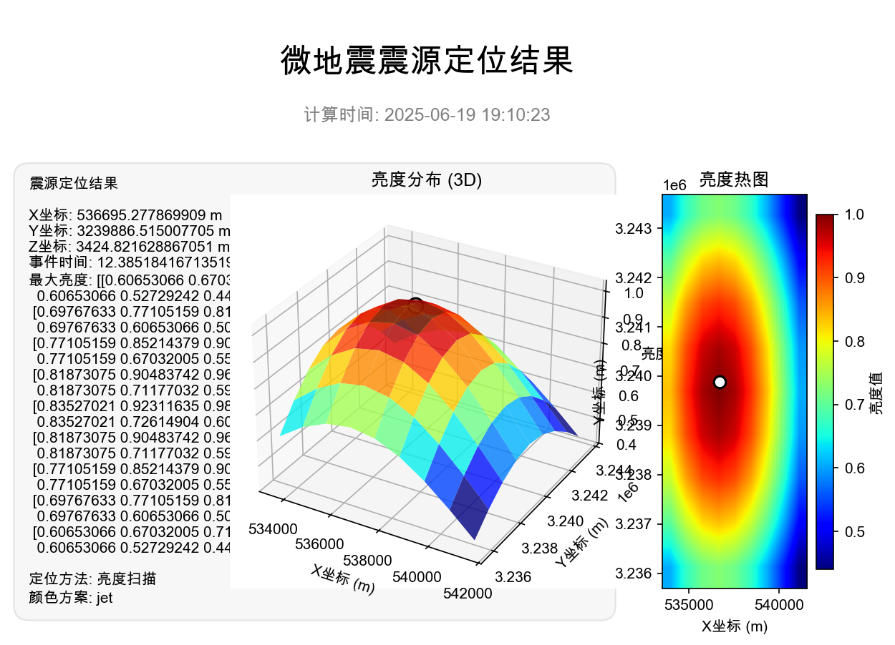
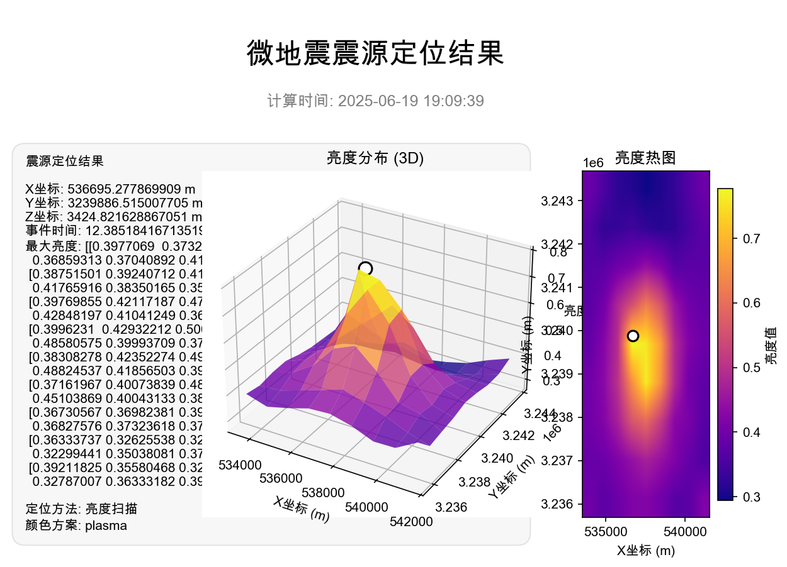

# SSATOP - 地震源位置检测与分析工具 🌍

SSATOP (Seismic Source Analysis and TOPography) 是一个专业的地震数据分析和震源定位桌面应用程序，基于Python和PyQt6开发。该工具结合了现代化的用户界面与高效的震源定位算法，为地震学研究、油气勘探和工程地震监测领域提供精确、高效的数据分析解决方案。



## 📚 项目背景

地震数据分析和震源定位是地球物理学研究和资源勘探的重要环节，传统的分析方法通常需要复杂的命令行操作和多种工具组合使用。SSATOP项目旨在提供一站式解决方案，将数据加载、波形处理、速度模型配置、震源定位和结果可视化集成到一个用户友好的图形界面应用中。本工具采用了多种算法，包括优化的网格搜索和遗传算法，能够更精确地确定震源位置。



## 🔄 最新更新

**版本 1.2.0 (2025-06-25)**
- 修复图像保存问题：解决双重保存对话框问题
- 优化波数据详情展示，使用表格格式呈现
- 修复原始波形图左侧振幅显示问题

完整的更新历史请查看 [CHANGELOG.md](CHANGELOG.md)

## 🌟 功能特性

- **波数据展示**：
  - 多通道波形数据同步显示与比较
  - 支持时间窗口灵活调整、缩放和滚动
  - 波形滤波、归一化和基线校正
  - 波形振幅和频谱分析

- **震源位置检测**：
  - 基于网格搜索的传统定位算法
  - 高效遗传算法优化定位，提高精度和计算效率
  - 实时进度与运算结果可视化
  - 三维定位结果与不确定性分析

- **速度模型管理**：
  - 内置多种地球参考速度模型
  - 简单恒定速度模型：适用于小区域近地表研究
  - 复杂地球模型：IASPEI 1991、AK135、PREM等，适用于不同尺度和深度的地震研究
  - 自定义速度模型配置与调优

- **批量处理功能**：
  - 多文件批量分析与处理
  - 自动化工作流配置与执行
  - 结果汇总与统计分析
  - 批处理报告生成与导出

- **系统功能**：
  - 文件管理：支持SGY、SEG-Y格式波形数据与Excel格式检波器位置数据
  - 系统设置：参数配置与优化调整
  - 主题设置：明暗两套主题与自定义颜色方案
  - 数据与结果导出：图像、CSV、Excel等多种格式

## 💻 系统要求

- **操作系统**：
  - Windows 10/11
  - macOS 10.14+ (Mojave及更新版本)
  - Linux (Ubuntu 18.04+, CentOS 7+)

- **硬件要求**：
  - 处理器：Intel Core i5/AMD Ryzen 5或更高
  - 内存：8GB RAM (推荐16GB或更高，特别是处理大型数据集)
  - 存储：至少500MB可用空间(不含数据文件)
  - 显示：1280x800分辨率或更高

- **软件环境**：
  - Python 3.8+ 
  - PyQt6
  - NumPy 1.20+
  - Pandas 1.3+
  - Matplotlib 3.5+
  - ObsPy 1.4+
  - SegyIO 1.9+

## 📦 安装方法

### 从源代码安装

1. 克隆仓库
```bash
git clone https://github.com/charrrrls/ssatop.git
cd ssatop
```

2. 创建虚拟环境(可选但推荐)
```bash
# 使用venv
python -m venv ssatop-env
# Windows激活虚拟环境
ssatop-env\Scripts\activate
# macOS/Linux激活虚拟环境
source ssatop-env/bin/activate
```

3. 安装依赖
```bash
pip install -r requirements.txt
```

4. 运行程序
```bash
python main.py
```

### 预编译版本

提供了Windows和macOS的预编译可执行文件，可直接下载运行，无需配置Python环境。

- **Windows**: 下载`ssatop-windows-x64.zip`，解压后运行`ssatop.exe`
- **macOS**: 下载`ssatop-macos.dmg`，挂载后拖动到Applications文件夹

访问[Releases页面](https://github.com/charrrrls/ssatop/releases)下载最新版本。

## 🔍 核心算法说明

SSATOP采用两种主要算法进行震源定位：

### 1. 经典网格搜索算法

基于遍历搜索的方法，通过以下步骤确定震源位置：

- 在可能区域内建立三维空间网格
- 对每个网格点和时间片计算亮度函数
- 亮度函数计算了各检波器记录的波形相对到达时间与理论时间的一致性
- 通过找到最大亮度值确定最优震源位置和发震时间

网格搜索计算公式：
```
亮度(x,y,z,t) = (1/N) * Σ[A_i(t + τ(x,y,z,r_i))]
```
其中，`A_i`是第i个检波器的波形振幅，`τ`是从位置(x,y,z)到检波器位置`r_i`的理论走时。

### 2. 遗传算法优化

为了提高计算效率和精度，SSATOP实现了遗传算法优化搜索：

- 初始化：随机生成可能解的初始种群
- 评估：计算每个解的适应度(亮度函数)
- 选择：选出最优个体进行繁殖
- 交叉与变异：生成新一代解
- 迭代：重复上述步骤直至收敛或达到最大代数

通过遗传算法，能够在较少的计算开销下获得比网格搜索更精确的结果，特别是对于大规模区域的震源定位。



## 🚀 详细使用指南

### 1. 数据准备与导入

在使用SSATOP前，您需要准备两种类型的数据：
- **波形数据文件**：标准的SGY或SEG-Y格式，包含多通道波形记录
- **检波器位置文件**：Excel格式，包含各检波器的空间坐标信息

数据导入步骤：
1. 启动SSATOP应用程序
2. 点击侧边栏的"文件管理"进入文件管理界面
3. 点击"导入波形数据"按钮，选择SGY/SEG-Y文件
4. 点击"导入检波器位置"按钮，选择Excel文件
5. 系统会自动解析和验证数据，显示导入状态

### 2. 波形数据查看与分析

1. 点击侧边栏的"波数据展示"
2. 在界面顶部选择要显示的通道或使用"全部显示"
3. 使用工具栏上的缩放、平移工具调整视图
4. 可用工具包括：
   - 振幅调整：改变波形显示幅度
   - 滤波器：应用低通/高通/带通滤波器
   - 基线校正：消除波形偏移
   - 时窗选择：标记感兴趣的时间段
   - 波形导出：将当前视图导出为图像

### 3. 震源位置检测

1. 确保已导入波形数据和检波器位置
2. 点击侧边栏的"源位置检测"
3. 配置检测参数：
   - 选择速度模型：从下拉列表选择合适的模型
   - 设置搜索时间范围：起始时间和结束时间
   - 配置网格分辨率：x、y、z三个方向的网格间隔
   - 选择算法：网格搜索或遗传算法
   - 对于遗传算法，可设置种群大小、代数、变异率等
4. 点击"开始检测"按钮
5. 实时查看进度条和中间结果
6. 检测完成后查看结果：
   - 震源位置坐标(x,y,z)
   - 发震时刻t
   - 亮度热图显示
   - 三维可视化图

### 4. 批量处理

1. 点击侧边栏的"批量处理"
2. 添加多个数据文件进入处理队列
3. 配置共同的处理参数
4. 点击"开始批量处理"
5. 监控处理进度和状态
6. 处理完成后查看汇总结果
7. 可将结果导出为报告或数据文件

### 5. 速度模型配置

1. 点击侧边栏的"速度模型"
2. 查看当前可用的速度模型列表
3. 选择模型查看详细参数
4. 调整模型参数或加载自定义模型
5. 测试模型有效性
6. 保存更改应用到系统

## ⚙️ 配置文件说明

SSATOP使用`config.yaml`文件存储系统配置。主要配置项包括：

```yaml
# 基本设置
Default:
  speed: 5500.0      # 默认P波速度(m/s)
  length: 20         # 默认网格间距-水平(m) 
  height: 20         # 默认网格间距-垂直(m)
  z_min: 0           # 最小深度(m)
  z_max: 1000        # 最大深度(m)
  time_slice: 0.01   # 时间片间隔(s)

# 算法设置
Algorithm:
  genetic:
    population_size: 300
    generations: 20
    mutation_rate: 0.2
    tournament_size: 3

# 界面设置
UI:
  theme: "light"      # light或dark
  language: "zh_CN"   # 界面语言
```

您可以直接编辑该文件或通过程序的设置界面修改这些参数。

## 🐞 故障排查

### 常见问题与解决方法

1. **程序无法启动**
   - 检查Python版本是否为3.8及以上
   - 确认所有依赖包已正确安装：`pip list`
   - 检查日志文件中的错误信息

2. **数据文件无法加载**
   - 确认文件格式是否为标准的SGY/SEG-Y
   - 检查文件是否被损坏或不完整
   - 检查文件权限问题

3. **波形显示异常**
   - 检查数据采样率设置是否正确
   - 尝试使用基线校正功能
   - 调整振幅缩放比例

4. **震源定位计算耗时过长**
   - 减小搜索区域或增大网格间距
   - 使用遗传算法替代网格搜索
   - 对于大型数据集，增加内存分配

5. **ObsPy相关错误**
   - 确认ObsPy版本与Python版本兼容
   - 重新安装ObsPy：`pip uninstall obspy && pip install obspy`
   - 检查是否缺少系统依赖库

### 日志收集

程序运行日志保存在以下位置：
- Windows: `%APPDATA%\ssatop\logs\`
- macOS: `~/Library/Logs/ssatop/`
- Linux: `~/.local/share/ssatop/logs/`

遇到问题时，请提供相关日志文件以便更好地诊断问题。

## 🤝 贡献指南

欢迎对SSATOP项目作出贡献！以下是参与方式：

### 提交问题和建议

1. 访问[项目Issues页面](https://github.com/charrrrls/ssatop/issues)
2. 点击"New Issue"按钮
3. 选择问题类型(Bug报告、功能请求等)
4. 完整填写模板信息
5. 提交Issue

### 贡献代码

1. Fork项目仓库
2. 创建特性分支：`git checkout -b feature/amazing-feature`
3. 提交更改：`git commit -m 'Add amazing feature'`
4. 推送到分支：`git push origin feature/amazing-feature`
5. 提交Pull Request

### 开发规范

- 遵循PEP 8 Python代码风格
- 为新功能添加相应的单元测试
- 保持代码注释完整，使用文档字符串
- 遵循MVC设计模式
- 使用有意义的变量名和函数名

## 📊 未来计划

SSATOP团队计划在未来版本中加入以下功能：

- 深度学习算法支持，提高震源定位精度
- 实时数据流处理与分析
- 多种地震相位识别与分析
- 三维速度模型构建与调整
- 云端数据同步与协作功能
- 更丰富的可视化选项和导出格式

## 📄 许可证

SSATOP项目采用MIT许可证。详情请见[LICENSE](LICENSE)文件。

```
MIT License

Copyright (c) 2025 charrrrls

Permission is hereby granted, free of charge, to any person obtaining a copy
of this software and associated documentation files...
```

## 💬 联系方式与支持

如有问题、建议或合作意向，请通过以下方式联系：

- **GitHub**: [@charrrrls](https://github.com/charrrrls)
- **问题反馈**: [GitHub Issues](https://github.com/charrrrls/ssatop/issues)
- **电子邮件**: 1220972572@qq.com

---

*SSATOP - 让地震源位置检测更简单、更精确* 