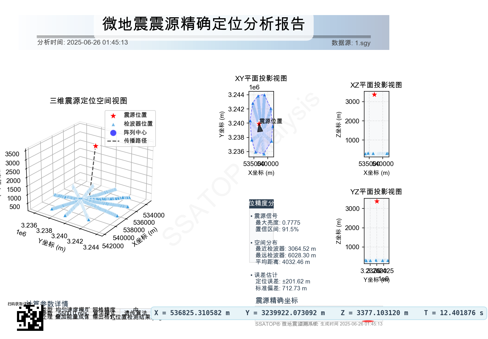

# SSATOP - 地震源位置检测与分析工具 🌍

SSATOP (Seismic Source Analysis and TOPography) 是一个用于地震数据分析和震源定位的桌面应用程序，基于Python和PyQt6开发。该工具提供了友好的图形界面，支持波形数据可视化、震源位置检测、多种速度模型和批量处理等功能。



## 🌟 功能特性

- **波数据展示**：可视化显示地震波形数据，支持多通道同时查看和比较
- **源位置检测**：基于多种算法分析并精确定位震源位置，包括传统网格搜索和遗传算法优化
- **速度模型**：内置多种地球速度模型（简单恒定速度、IASPEI 1991、AK135等），适应不同尺度的地震研究
- **批量处理**：支持多文件批量分析，自动生成报告和可视化结果
- **文件管理**：导入、管理波形数据文件(SGY格式)和检波器位置数据
- **系统设置**：灵活配置系统参数，适应不同的研究需求
- **主题设置**：支持自定义界面主题，提供明暗两套主题和色彩定制

## 💻 系统要求

- **操作系统**：Windows 10+/macOS/Linux
- **Python**：3.8+ 
- **依赖库**：PyQt6, NumPy, Pandas, Matplotlib, ObsPy等

## 📦 安装方法

### 从源代码安装

1. 克隆仓库
```bash
git clone https://github.com/charrrrls/ssatop.git
cd ssatop
```

2. 安装依赖
```bash
pip install -r requirements.txt
```

3. 运行程序
```bash
python main.py
```

### 预编译版本

提供了Windows和macOS的预编译版本，可直接下载运行，无需配置Python环境。
访问[Releases页面](https://github.com/charrrrls/ssatop/releases)下载最新版本。

## 🚀 快速入门

1. **导入数据文件**：
   - 打开应用后，进入"文件管理"页面
   - 导入SGY格式的波形数据文件
   - 导入Excel格式的检波器位置文件

2. **数据可视化**：
   - 在"波数据展示"页面查看波形数据
   - 可调整显示参数，如时间窗口、通道选择等

3. **震源位置检测**：
   - 进入"源位置检测"页面
   - 选择适当的速度模型和搜索参数
   - 启动检测过程，查看结果热图和定位结果

4. **批量处理**：
   - 在"批量处理"页面选择多个数据文件
   - 配置处理参数，执行批量检测
   - 查看和导出结果报告

## 🔍 项目结构

```
ssatop/
├── Controllers/          # MVC控制器组件
│   ├── FileUploadWidgetController.py
│   ├── WaveDisplayWidgetController.py
│   ├── SourceDetectionWidgetController.py
│   └── ...
├── Models/               # 数据模型组件
│   ├── Config.py         # 配置管理
│   ├── ModelManager.py   # 速度模型管理
│   ├── TaskRunner.py     # 任务执行
│   ├── ThemeManager.py   # 主题管理
│   ├── TraceFile.py      # 波形文件处理
│   └── VelocityModel.py  # 速度模型实现
├── Views/                # 视图组件
│   ├── FileUploadWidget.py
│   ├── WaveDisplayWidget.py
│   ├── SourceDetectionWidget.py
│   └── ...
├── Services/             # 业务逻辑服务
│   ├── ssatop.py         # 核心算法实现
│   └── find_time.py      # 时间检测服务
├── main.py               # 主程序入口
├── config.yaml           # 配置文件
└── requirements.txt      # 项目依赖
```

## 📊 速度模型说明

SSATOP支持多种速度模型，包括：

- **简单恒定速度模型**：使用固定的P波和S波速度，适合局部小尺度研究
- **IASPEI 1991参考地球模型**：国际标准地球参考模型，适合全球尺度定位
- **AK135模型**：Kennett等提出的改进版参考模型，适用于远震定位
- **PREM模型**：考虑地球旋转和各向异性的初步参考地球模型
- 其他模型：JB模型、SP6模型、1066a模型等

## 🛠️ 技术细节

- **GUI框架**：PyQt6
- **数据处理**：NumPy, Pandas
- **可视化**：Matplotlib
- **波形文件处理**：ObsPy, SegyIO
- **优化算法**：遗传算法、网格搜索

## 📄 许可证

MIT License

## 💬 联系方式

如有问题、建议或合作意向，请联系：
- GitHub: [@charrrrls](https://github.com/charrrrls) 